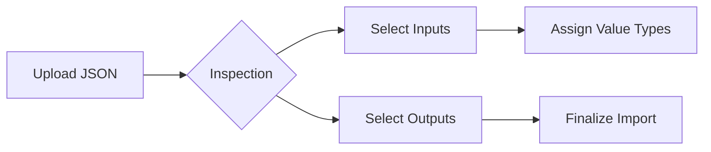

# 🔌 ComfyUI Integration Guide

ComfyUI is the powerful engine behind 3D Gen Studio. By importing your custom workflows, you can extend the studio's capabilities with any stable diffusion or 3D generation technique.

---

## 🛠️ Prerequisites

Before you can import and run workflows, ensure the following:

1.  **ComfyUI is Running**: Start your ComfyUI instance.
2.  **API Access**: Ensure ComfyUI is accessible via its web API (default: `http://127.0.0.1:8188`).
3.  **Dev Mode Enabled**: In ComfyUI, go to **Settings** and enable **"Enable Dev mode Options"**. This is required to export the JSON format that 3D Gen Studio understands.

> [!IMPORTANT]
> 3D Gen Studio communicates with ComfyUI via WebSockets and HTTP. If you are running ComfyUI on a different machine, make sure to update the host in the **Project Settings**.

---

## 📥 Importing a Workflow

The import process transforms a standard ComfyUI JSON into a reusable, parameterized action within the Studio.

### 1. Export from ComfyUI
- Open your workflow in ComfyUI.
- Ensure all nodes are correctly connected.
- Click **"Save (API Format)"** in the sidebar. This will download a `.json` file.

### 2. Upload to 3D Gen Studio
- Navigate to the **Assets Library** tab.
- Select the **Workflows** section.
- Click the **"Import JSON"** button and select your exported file.

### 3. Configure Parameters & Outputs
Once uploaded, the Studio will inspect the workflow and present a configuration screen:

- **Inputs**: Select which nodes you want to expose as editable parameters (e.g., Prompt, Seed, Steps).
- **Type Mapping**: Assign types to your inputs (e.g., mapping a Load Image node to the "Image" type allows you to pass images from your Kanban cards).
- **Outputs**: Select which nodes contain the final result (e.g., Preview Image, Save Image, or Mesh Export).

---

## 🚀 Using Your Workflows

Once imported, your workflows can be utilized in two primary ways:

### 📋 Kanban Actions
Each stage in your Kanban board can be linked to a workflow. 
- Click the **"Action"** icon on a card.
- Select your imported workflow.
- If the workflow expects an image input, it will automatically use the card's current image.
- The output will be appended to the card or moved to the next stage.

### 🕸️ Graph View
In the Graph view, workflows appear as functional nodes.
- Drag a workflow from the library into the graph.
- Connect outputs from image/mesh nodes into the workflow's input ports.
- Trigger the workflow to see results propagate through the graph.

---

## 💡 Pro Tips

> [!TIP]
> **Dynamic Primitive Nodes**: Use ComfyUI "Primitive" nodes for parameters you intend to change often. 3D Gen Studio recognizes these easily and maps them to clean UI sliders and inputs.

> [!WARNING]
> **Custom Nodes**: Ensure all custom nodes used in your workflow are installed on the ComfyUI instance that 3D Gen Studio is connected to. The Studio does not install missing nodes for you.

---

## ❓ Troubleshooting

| Issue | Solution |
| :--- | :--- |
| **Connection Refused** | Check if ComfyUI is running and the port matches your Studio settings. |
| **Missing Inputs** | Ensure you used "Save (API Format)". Standard "Save" JSONs don't include the necessary execution metadata. |
| **Outputs Not Appearing** | Ensure you selected at least one node as an "Output" during the import step. |

---

  <b>Need help with a specific workflow?</b> 
  Check out our <a href="https://github.com/visualbruno/3DGenStudio/discussions">Discussions</a> or browse the <a href="https://comfyanonymous.github.io/ComfyUI_examples/">Official ComfyUI Examples</a>.

